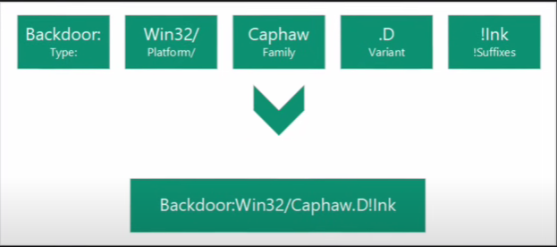

# Malware Classification by Windows Defender

Windows Defender classifies malware into various categories based on their behavior and characteristics. These categories include viruses, worms, trojans, ransomware, spyware, adware, and others. Each category represents a different type of threat and requires a different defensive strategy. For instance, a virus is a type of malware that replicates itself by modifying other computer programs, while a trojan is a type of malware often disguised as legitimate software. Windows Defender uses this classification system to help detect and mitigate the different types of malware threats.

Windows Defender classifies malware based on various terms:

* **Type**: This refers to the specific category of malware, such as virus, worm, trojan, and others. Each type has unique behaviors and characteristics.
* **Platform**: This term denotes the environment where the malware operates. It could be a specific operating system like Windows, Mac, or Linux, or a specific device like a PC, smartphone, or IoT device.
* **Family**: This term is used to group malware with similar traits or behaviors. A malware family usually shares a common codebase and functionalities.
* **Variant**: A variant is a different version of a malware from the same family. Variants typically have some modifications in their code or behavior to evade detection or target different systems.
* In the malware classification by Windows Defender, "!suffixes" is not directly defined. It's possible you may be referring to the use of "!" before certain terms. For example, "!Ink" is used to denote a specific type of file that can potentially contain malware. However, without further context or specific reference to "!suffixes" in Windows Defender documentation, it's difficult to provide a precise definition. **!Ink**: This is a specific type of file that Windows Defender can recognize as potentially containing malware. It is typically a shortcut file (.ink), but it is manipulated to execute harmful scripts or programs.
